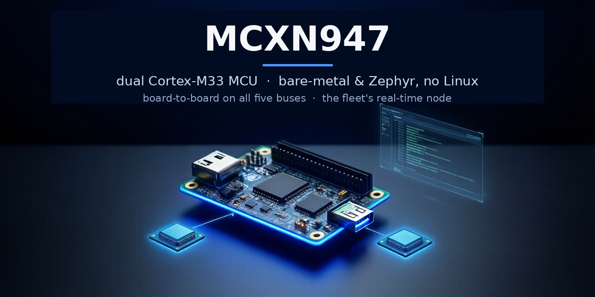

# qemu-mcxn947

A QEMU machine type for the NXP **MCX N947** microcontroller — a **dual Arm
Cortex-M33** MCU — targeting the **FRDM-MCXN947** board. Machine: `frdm-mcxn947`.

> **This is a fork of QEMU mainline.** The MCX N work lives on the `mcxn947`
> branch; the bulk of the history is upstream QEMU. The upstream QEMU README is
> preserved at [`README.rst`](README.rst) — this file describes the MCX N-specific
> work. All model logic is self-contained in new `mcxn_*` files (no edits to
> generic QEMU), with the long-term aim of upstream-mergeability.

qemu-mcxn947 is a QEMU model of the NXP MCXN947, and one node in a fleet of NXP
QEMU ports (i.MX 91 / 93 / 95, i.MX RT1180, and this MCXN947 microcontroller) that
share device models and a validation standard. Unlike the i.MX 9x siblings, this is a
**microcontroller, not an applications processor**: there is no Linux and no
MMU-class OS. You run the same firmware you would flash to the silicon —
**bare-metal, Zephyr, or the MCUXpresso SDK** — against a register-accurate model
of the whole chip. It is not cycle-accurate.

It boots the Zephyr **`frdm_mcxn947`** target and passes the upstream Zephyr
**`ztest`** suite (kernel + IPC + the userspace / MPU / SAU TrustZone-M path).
Every peripheral base on the chip has a register-accurate model; the blocks whose
behaviour firmware can observe have live data paths and NVIC interrupts on top.
Beyond running on one board, it passes real data between instances over five board
buses (see [Interconnect](#interconnect--board-to-board-mission-5)). Intended use:
firmware and peripheral-driver development, multicore / RPMsg bring-up, multi-board
lab work, and CI; the long-term aim is upstream-mergeability into QEMU mainline.

**Maintainer:** Kyle Fox ([@kylefoxaustin](https://github.com/kylefoxaustin))

*Part of a consistent hero-image family across the QEMU fleet — solid silicon for
the emulator repos, one accent per node (MCXN947 cobalt-blue). The two glowing
dies are the dual Cortex-M33 cores; the USB connector is the CDC-ACM gadget that
pairs with the Linux boards.*

## Quickstart

This fork **builds and runs as-is** — a plain clone lands on `mcxn947`.

**1. Clone and build** (host packages under [Building](#building)):

    git clone https://github.com/kylefoxaustin/mcxn947qemu.git
    cd mcxn947qemu
    ./configure --target-list=arm-softmmu
    make -j"$(nproc)"                                  # or: ninja -C build qemu-system-arm
    ./build/qemu-system-arm -M help | grep frdm-mcxn947   # -> frdm-mcxn947

**2. Run your firmware.** The MCX is bare-metal — you supply a `-kernel` ELF (no
Linux, no DTB), exactly the image you would flash to the board:

    ./build/qemu-system-arm -M frdm-mcxn947 -kernel your-firmware.elf \
        -nographic -serial mon:stdio

Three details are load-bearing:

- **Console = FlexComm4 / LPUART4** is `serial_hd(0)`, so `-serial mon:stdio` gives
  you console + the QEMU monitor. The second core's console (FlexComm2 / LPUART2)
  is `serial_hd(1)`.
- **Semihosting works from the first instruction**, before any UART is set up:
  add `-semihosting-config enable=on,target=native` for early output.
- **`-kernel` runs code linked at flash `0x0000_0000`**; code linked into the
  FlexSPI XIP window at `0x8000_0000` (secure `0x9000_0000`) runs in place.

A Zephyr `hello_world` built for `frdm_mcxn947/mcxn947/cpu0` is the quickest
"it works" image; the console prints over FlexComm4. `-d unimp,guest_errors`
surfaces any access into unmodelled space (rare — the whole peripheral window is
modelled; register-accurate models sit over a catch-all backstop).

## What runs today

The Zephyr **`frdm_mcxn947`** target boots and the **`ztest`** suite passes on the
dual Cortex-M33. Every peripheral base is register-accurate; this table is the
condensed capability view, with the per-IP-block evidence and the detailed class
language in
[`docs/validation/test-result-matrix.md`](docs/validation/test-result-matrix.md)
(one source of truth, `test-matrix.yaml`, two renderings). Tiers: **A** data-path
verified (real data moves / real math, integrity-checked) · **B** register-accurate
bring-up (binds, registers / IRQ / timing correct; analog inputs operator-driven;
proprietary accels honestly flagged) · **N/A** absent on MCXN947 silicon.

<!-- BEGIN capability-table (generated from test-matrix.yaml) -->
| Subsystem | Tier | Evidence |
|---|:--:|---|
| Dual Cortex-M33 (cpu0 boot + cpu1 release), NVIC/SysTick | A | cpu0 releases cpu1 via SYSCON CPUCTRL/CPBOOT; both run (tests/mcxn-dualcore) |
| Inter-core MAILBOX + RPMsg-style shared-memory ring | A | Real message data cpu0<->cpu1, byte-exact (tests/mcxn-mailbox, mcxn-rpmsg) |
| Console + FlexComm (LPUART / LPSPI / LPI2C) + FlexIO SPI — real devices | A | Zephyr console; LPI2C master -> a real at24c EEPROM (write/readback byte-exact + NACK, tests/mcxn-lpi2c-eeprom), LPSPI + FlexIO-as-SPI masters -> a real m25p80 NOR (JEDEC ID + page-program/read-back, tests/mcxn-lpspi-nor, mcxn-flexio-spi-nor), board-to-board links (tests/mcxn-flexcomm, mcxn-spi-link, mcxn-uart-link).  Each replaced a self-oracle (I2C echo / SPI loopback) with a genuine upstream device |
| USB — device (KHCI + ChipIdea, CDC-ACM) + KHCI HOST enumeration | A | Device: enumerates on stock Linux cdc_acm -> /dev/ttyACM0, bulk byte-exact (tests/mcxn-usb-cdc). Host: the KHCI enumerates a real usb-kbd (descriptor + SET_ADDRESS) AND reads a real block from an attached usb-storage over SCSI/BOT (tests/mcxn-usb-host, mcxn-usb-host-msc); mutation-proven real-data |
| Networking — ENET (descriptor-ring MAC) | A | Zephyr stack: DHCP lease + TCP echo over a QEMU NIC (tests/mcxn-enet*) |
| FlexCAN x2 | A | Loopback + board-to-board frame round-trip, and a real RX matching process: two FlexCANs on one can-bus, so frames cross the BOARD-TO-BOARD path. A frame lands in the mailbox that FILTERED for it (the bus path used to do no ID matching at all, so a driver trusting its own filter read another node's frame); a frame arriving on an unserviced mailbox OVERWRITES it and sets CODE=OVERRUN per the RM, instead of being dropped in silence; and a controller with MCR[MDIS] set receives nothing. Note the first version of this test used LOOPBACK and mutation testing proved it was DECORATION -- loopback delivery is a separate code path, so it could not catch a single bus-path bug (tests/mcxn-flexcan, mcxn-flexcan-rx, mcxn-can-link) |
| I3C controller — drives a real I2C bus | A | The controller decodes MCTRL (REQUEST/ADDR/DIR/RDTERM) into real i2c_start_transfer/i2c_send/i2c_recv on a bus the SoC exposes. The model supplies the BUS as the silicon does and does NOT invent a device onto it: the test attaches a genuine QEMU at24c EEPROM (-device at24c-eeprom,bus=i2c-bus.0) and the bytes read back BYTE-EXACT — a golden living in a device the I3C model cannot see. An absent target NACKs (MERRWARN) instead of reporting a completed transfer (tests/mcxn-i3c) |
| EMVSIM (smartcard) — registers/IRQs only, NO DATA PATH | B | RETRACTED from tier A on 2026-07-12: mutation-testing showed it moves no data (RX_BUF is a stub) and its test asserted only that an interrupt fired, so a corrupted-data mutation could not fail it. Unlike SAI and I3C — which have both since earned tier A back — EMVSIM has NO PEER to talk to: a smartcard interface needs a card, and there is no card model. Registers and IRQs are correct; an honest data path needs an ISO-7816 card, which is roadmap |
| Storage / XIP — FlexSPI NOR | A | FlexSPI drives a real SPI-NOR (LUT/IP commands: WREN + erase + page program, bits only 1->0) with a byte-exact erase -> program -> read-back round trip against a genuine QEMU m25p80 w25q64 — a golden the FlexSPI model does not own. Code runs in place from the same array via the XIP window, which refuses CPU stores (tests/mcxn-flexspi-nor, mcxn-xip) |
| uSDHC (SD/MMC) — drives a real SD card | A | tier A RE-EARNED 2026-07-12. It had been claimed for 'uSDHC ADMA block data' while HAVING NO ADMA AND NO BLOCK DATA: no dma_memory_*, no descriptor walk, no storage — it could not move one byte — and it CONJURED THE CARD (CMD8/CMD3/ACMD41/CMD2 responses invented in CMD_RSP0..3, CINST hardwired so firmware 'detected' a card that was not there). ⭐ AND IT PASSED THE MUTATION AUDIT: the old test did compare values, but CMD8 only 'passed' by the model ECHOING THE TEST'S OWN ARGUMENT (0x1AA in, 0x1AA out) and CMD3 only by the test being told the model's hardcoded RCA — both sides of the comparison came from the same fiction, so the model was its own oracle. Mutation testing proves a test is COUPLED to the model, not that it checks anything REAL; against a conjured peer it is blind by construction. NOW: the model supplies only the BUS and the test attaches a genuine QEMU sd-card, so every response and every byte comes from the card. Real ADMA2 descriptor walk (VALID/END/LINK/TRAN; a bad descriptor raises DMAE), plus SDMA and PIO. The golden is a HOST IMAGE FILE the model cannot reach: the guest reads back a block the host wrote before boot, writes another via ADMA2, and the harness re-checks those bytes IN THE FILE after QEMU exits — so the write really left the emulator. An EMPTY SLOT TIMES OUT (INT_STATUS[CTOE]) and reads CINST=0 instead of the host answering for a card that is not there (tests/mcxn-usdhc) |
| Timers / PWM — CTIMER, MRT, LPTMR, OSTIMER, SCT, eFlexPWM, RTC | A | Timer/PWM data paths + IRQs. The eFlexPWM CARRIER PERIOD is measured against SysTick -- an Arm core timer, independent of every peripheral model -- under -icount so the measurement is deterministic, and SWEPT ACROSS THE PRESCALER (PRSC=0/1/3, i.e. /1 /2 /8). ⭐ THE OLD VERSION OF THIS ROW WAS HALF TRUE AND HID TWO BUGS: (1) CTRL[PRSC] WAS NOT MODELLED AT ALL -- a driver asking for an 8x slower carrier got the same one, silently, and eFlexPWM carrier frequency IS motor control; (2) the counter tick was an INVENTED ~100 MHz appearing nowhere in the RM. Both survived because THE TEST DIVIDED BY THE SAME CONSTANT AS THE MODEL and never set PRSC: SysTick genuinely catches a DRIFTING carrier (that is what it was written for, and it did) but CANNOT catch a wrong TICK RATE or an ignored prescaler -- a careful measurement on one side of a comparison makes the other side INVISIBLE (backend hit the identical shape in a perf/W ratio: THE STALE TERM IS WHICHEVER ONE YOU DID NOT JUST WORK ON). Now: the counter runs from the IPBus clock / 2^PRSC per the RM, the expected SysTick count comes from the RM semantics ((VAL1-INIT+1) << PRSC) and not from the model, and every PRSC must move the carrier by exactly 2^PRSC. Negative-tested BOTH ways: ignore PRSC -> FAIL; restore the old 100 MHz tick -> FAIL (the old test could not catch either). The absolute IPBus rate is NO LONGER an assumption (2026-07-20): the FlexPWM counter is clocked by a real Clock input = the SCG main clock (its IPBus clock is the bus/core clock), so it is DERIVED -- 48 MHz at the FRO_HF reset, 150 MHz once firmware brings up PLL0, and it follows a reconfigure. mcxn-pwm now runs at the RESET clock without configuring the PLL: the PWM counter and SysTick both derive from the main clock, so the (VAL1+1)<<PRSC tick-count golden holds because they SHARE the clock -- pin the PWM to a 150 MHz constant while SysTick sits at 48 MHz and it misses the golden (mutation-proven). The hardcoded PWM_IPBUS_HZ 150 MHz constant is gone (tests/mcxn-pwm, mcxn-ctimer, mcxn-timers, mcxn-ostimer, mcxn-sct, mcxn-rtc, mcxn-coreclk) |
| TrustZone-M secure alias — every peripheral, both views | A | TrustZone aliases every peripheral non-secure at 0x400x_xxxx and secure at 0x500x_xxxx (+0x1000_0000). The SoC creates 34 such aliases and NOT ONE TEST HAD EVER TOUCHED ANY OF THEM -- the entire suite drove the non-secure view only, so a mis-mapped alias would have left everything green while TrustZone-secure firmware (TF-M / NXP secure boot, the NORMAL case on MCX N) talked to the wrong peripheral or to nothing at all. Found by asking ollama_95_neutron's question -- 'the rigour on one AXIS is the camouflage on the axis you never named' -- of my own tree: I had swept prescalers, filter orders, matrix shapes and access widths, and never once swept the SECURITY ALIAS. Now swept across 8 peripherals: the same identity register must read identically through both views, AND a write through one view must be visible through the other -- the SAME DEVICE, not a copy (a fresh MemoryRegion at the secure base would pass the first check and fail the second). Negative-tested: move the alias base -> FAIL; misplace ONE peripheral's alias -> FAIL (tests/mcxn-secure-alias) |
| GPIO + eDMA (incl. PERIPHERAL-TRIGGERED DMA) | A | GPIO toggles; eDMA TCD transfers, software-triggered AND hardware-request-triggered. CH_CSR[ERQ] was previously a DEAD CONSTANT and no peripheral had a request line, so DMA-driven audio/ADC/UART -- how nearly all real transfer works -- could not run at all. Peripherals now drive one line per CMSIS request-mux source (SAI0 Tx=100), a channel consumes the source its CH_MUX[SRC] selects, one MINOR LOOP per request, and TCD_CSR[DREQ] auto-clears ERQ at major completion. Proven stock-driver-shaped: the CPU arms a channel at the SAI TDR, sets TCSR[FRDE] and NEVER WRITES TDR AGAIN -- every word is carried by the DMA and returns byte-exact through the board loopback. Requests are serviced in a BOTTOM HALF: servicing inline from the peripheral's own MMIO write is a re-entrant access QEMU SILENTLY DROPS, which looks exactly like success (CITER decrements, DONE sets, INTMAJOR fires) while moving ZERO bytes -- negative-tested Proven across request sources that span the mux: SAI0 Tx (=100, byte-exact through the board loopback), DAC0 (=25, operator-probed on the pin), ADC0 FIFO A/B (=21/22, FWMDE-gated), the LPFlexcomm serials (69..88, LPUART/LPSPI/LPI2C EDMA drivers), SINC0 (=103..107, one line per channel, gated by CnCCR[DMAEN], carrying real CIC results to memory in mcxn-sinc-dma with a closed-form OSR^ORD oracle and mutation-proven), FLEXSPI0 (RX=1/TX=2, each gated by IP{RX,TX}FCR[DMAEN]) -- a round trip that TX-DMA page-programs a genuine m25p80 NOR then RX-DMA reads it back byte-exact against a golden the model does not own, mutation-proven in BOTH directions (invert either gate -> clean FAIL, so FLEXSPI_TransferEDMA no longer hangs), and FLEXPWM value-register DMA (the motor-control path: FlexPWM0 Val0=43/FlexPWM1 Val0=51, gated by SM0.DMAEN[VALDE]) -- on each reload the eDMA writes the next duty word into VALx, swept on TWO axes: DATA (VAL3 ends holding the last duty word, carried purely by reload DMA, CPU never wrote it) and RATE (one word per reload, so under -icount the 8-word transfer takes ~8 carrier periods measured against SysTick). Mutation-proven both axes: invert VALDE -> no words move -> FAIL; break the per-reload deassert so the buffer drains in a single reload -> finishes in ~1 period -> the SysTick RATE floor FAILs (so PWM_SetupPwmDMA no longer hangs). And CTIMER MATCH DMA (M0=7+2k/M1=8+2k): a match event drives the request (no CTIMER DMA-enable of its own; INPUTMUX gates it) as a one-shot PULSE. This added a general eDMA edge path -- a FIFO source holds a level the drain loop keys off, but a timer match has no level to lower and no write-back to hook, so the engine auto-acks a pulse after one minor loop and drops an unconsumed pulse at BH end. Stock-driver-shaped (mcxn-ctimer-dma): a flash pattern paced into SRAM one word per match, mutation-proven on DATA and RATE (8 words take >=7 self-calibrated match periods; break the auto-ack -> whole buffer in one match -> FAIL). SCT reuses that same edge path (SCT0 DMA0=19/DMA1=20, gated by DMAREQ0/1[DEV_n] selecting which event drives each request): mcxn-sct-dma paces the same one-word-per-event transfer, mutation-proven on both axes. Remaining: PDM/MICFIL (=18) -- but only because there is no mic bitstream in emulation, so the FIFO is empty and the request could never assert (the gap is the source, not the line); FlexPWM CAPTURE DMA (39-42/47-50) is the same shape, needing an input edge on the PWM pins that has no signal source in emulation. HsCmp/CMP (28-30) is now OPERATOR-DRIVEN through the eDMA edge path (mcxn-cmp-dma): its crossing was already exposed as the comparator-output QOM property, so CCR1[DMA_EN] redirecting an IER-enabled edge to the DMA request just needed wiring -- the operator injects one crossing over QMP and it moves exactly one word, mutation-proven on both axes. PINT (pin interrupt) went from a register stub to FUNCTIONAL to earn its DMA (mcxn-pint-dma): operator-driven pin input (pin-input QOM property) -> edge-detect (RISE/IST) -> PINT0_IRQn=47 -> INT0..3 eDMA (sources 3..6); one injected edge proves DMA/rate/edge/NVIC together, mutation-proven on all three paths. PDM/MICFIL (18) is now operator-fed (mic-input QOM property -> FIFO -> watermark -> level DMA request, drained byte-exact, mutation-proven on data + gate). And FLEXPWM CAPTURE is now closed too (the last input-seam): an operator-driven input-A edge (capture-a-input QOM property) captures the counter into CVAL0 and DMAEN[CA0DE] pulses the request (mcxn-flexpwm-capture), mutation-proven on the capture-DMA and edge-select axes. Every eDMA request source is now wired (tests/mcxn-gpio, mcxn-dma, mcxn-sai-dma, mcxn-dac-dma, mcxn-adc-dma, mcxn-sinc-dma, mcxn-flexspi-dma, mcxn-flexpwm-dma, mcxn-ctimer-dma, mcxn-sct-dma, mcxn-cmp-dma, mcxn-pint-dma, mcxn-pdm-dma) |
| PowerQuad DSP (matrix/vector + CP0 transcendentals) | A | Computes real results — matrix/vector ops + scalar sin/cos/ln/divide. SWEPT ACROSS SHAPES: a 2x2*2x2 multiply cannot catch a dimension bug, because LENGTH's three fields (rows of A, cols of A, cols of B) are all equal and swapping any two changes nothing. Non-square 2x3*3x2 and a 1x3*3x1 dot product make every stride distinct. Negative-tested with an output-stride swap that is bit-identical on square matrices: the old test passes it, the sweep catches it (tests/mcxn-powerquad) |
| Audio — SAI (I2S) + DAC output FIFO | A | SAI moves real audio: 8-word TX/RX FIFOs draining at the word rate the firmware programmed, words byte-exact end-to-end over a board-level TXD->RXD jumper, with a real overrun on a full FIFO and underrun on an empty one. DAC drives a real output FIFO — occupancy, FULL/EMPTY/watermark, overflow drops the sample, underflow holds the output, and a level IRQ deasserts on refill (tests/mcxn-sai, mcxn-dac) |
| SINC sigma-delta filter (computes) | A | Real CIC: the RM's H(z) = ((1-z^-OSR)/(1-z^-1))^ORD decimates a register-fed (PM/SM) modulator bitstream to a 24-bit result. SWEPT ACROSS SHAPES, not stamped at one: an all-ones bitstream must settle to the CIC's DC gain OSR^ORD — a closed-form golden independent of the implementation — at (ORD,OSR) = (1,16) (2,16) (3,8) (2,32) (1,4). Negative-tested with a shape-dependent bug that is correct at ORD=1 and wrong above it: the single-shape check passes it, the sweep catches it (tests/mcxn-sinc) |
| Flash program — FMU (storage-write-verified) | A | Byte-exact erase -> program -> read-back round-trip driven through the RM PEWEN/PERDY sequence; flash is a ROM device, so stores outside a program window are refused and cumulative programming fails verify (tests/mcxn-fmu) |
| Security — ELS entropy (TRNG); crypto HONESTLY FAULTED, never faked | A | TRNG is real: fresh entropy per read and via RND_REQ DMA, driving Zephyr stack_random (ztest userspace path). The crypto engine (AES/HASH/HMAC/CMAC/ECDSA/ECDH/key-derivation) is NOT implemented and is NOT faked: every such command fails through the engine's own error channel (ELS_STATUS[ELS_ERR] + ELS_ERR_STATUS[OPN_ERR]) and leaves the result buffer untouched, so firmware is told rather than handed uninitialised memory as a signature or key. BUSY still clears, so no driver hangs (tests/mcxn-els) |
| Watchdogs + micro-tick — WWDT, EWM, UTICK | B | Register-accurate; reset/refresh/timeout semantics |
| Accelerators (honest) — Neutron NPU, SmartDMA, PowerQuad fixed-point | B | Nothing is fabricated and nothing hangs: the Neutron NPU flags its UNCOMPUTED result to the GUEST (INTR[ERRORTRAP] + IRQ 97), SmartDMA leaves CTRL[START] set because its program never ran and no data was moved, and PowerQuad's unmodelled opcodes fail via ERRSTAT[BUSERROR] rather than leaving a stale result. Host-only flags (QMP/log) are NOT sufficient — the firmware under test cannot see them (tests/mcxn-neutron, mcxn-powerquad-coproc) |
| Analog & audio-in — ADC, CMP, TSI, OPAMP, VREF, PDM | B | Register-accurate; analog inputs operator-driven via QOM property. PDM has no bitstream source in emulation and says so: it produces NO samples and flags FIFO underflow rather than fabricating silence firmware cannot tell from real audio |
| INPUTMUX — eDMA request gating (DMAn_REQ_ENABLE) | A | Closing a request's gate really BLOCKS the transfer and re-opening it lets it through; an ungated model is MORE PERMISSIVE THAN SILICON, which ships the bug to the board (tests/mcxn-inputmux-gate). TRIGGER ROUTING drives the ADC from all three timer/PWM sources: an LPTMR compare (selector 50, tests/mcxn-adc-hwtrig), a CTIMER match (CTIMER0/1/2 M3 = selectors 5/6/7, tests/mcxn-adc-ctimer-trig), AND -- the motor-control synchronous-sampling path -- a FlexPWM submodule OUTPUT TRIGGER (FlexPWM0/1 SM0 PWM_OUT_TRIG0/1 = selectors 24/25 and 32/33, tests/mcxn-adc-pwm-trig). The same router also drives the DAC and the comparator: a timer through DACn_TRIG advances the DAC output FIFO one sample per trigger (fsl_dac external-trigger waveform, gated by GCR[TRGSEL]; tests/mcxn-dac-hwtrig), and a timer through CMPn_TRIG paces the comparator's round-robin sampling -- CSR[RRF] flags a deviation from the RR_INITMOD baseline, gated by RRCR0[RR_TRG_SEL] (tests/mcxn-cmp-trig); and a timer through QDCn_TRIG captures the quadrature-decoder position -- CTRL2[UPDHLD] snapshots UPOS/LPOS/REV into the hold registers (coherent, PWM-synchronised) or CTRL2[UPDPOS] clears them (tests/mcxn-qdc-trig); and a timer through TSI_TRIG paces the touch-sensing scan -- DATA[EOSF] + the operator electrode count, gated by GENCS[STM] hardware-trigger mode (tests/mcxn-tsi-trig). A VALn compare mid-carrier pulses the output trigger and the ADC samples phase-current at that exact counter position -- CPU-free. Each source's trigger-EVENT output had to be built: it did not exist, so the INPUTMUX routed a signal that never pulsed (silent -- a router that routes nothing looks exactly like a router). All are TCTRL[HTEN]-gated (routed-but-unarmed must NOT convert). Selectors DERIVED from NXP's compiled driver (Ctimer{k}M3=5+k, Pwm{m}A0Trig{t}=24+8m+t), not guessed. Mutation-proven per source (sever the trigger pulse / disable the HTEN gate; for the FlexPWM, ignore TCTRL[OUT_TRIG_EN] -> extra conversions -> the SysTick RATE floor FAILs). The selectors are PER-DESTINATION where silicon says so: ADC0_TRIG=8/9 name CTIMER3/4 M3, but ADC1_TRIG=8/9 name CTIMER3 M2 / CTIMER4 M1 (same written value, different physical match) -- modelled and mutation-proven (tests/mcxn-adc-ctimer-adc1-trig: drive only CTIMER3 M2 -> ADC1 converts, ADC0 stays silent, ADC0 still converts on SWTRIG; drop the ADC1 remap -> ADC1 falls back to the silent M3 -> FAIL). Stated boundary: the FlexPWM output trigger is modelled for submodule 0 at full rate (TCTRL[TRGFRQ] every-other-period division not modelled) -- an honest gap, not faked |
| Pin / IRQ / GPIO infra — PORT, PINT, INTM, EVTG, QDC, PLU | B | Drivers bind; pin-mux / IRQ routing registers correct (sub-word MMIO) |
| CRC engine (computes) | A | Verified against three PUBLISHED check vectors over "123456789" — CRC-16/CCITT-FALSE 0x29B1, CRC-32/MPEG-2 0x0376E6E7, CRC-32/IEEE 0xCBF43926 — so the goldens are independent of this implementation, and three configurations are swept rather than one stamped (tests/mcxn-crc) |
| Memory / cache — CACHE64, NPX, SEMA42, OTPC | B | Register-accurate; cache/ID/fuse config |
| Clocks / power / system — SCG, SYSCON, SPC, CMC, VBAT, WUU, FREQME, AHBSC | B | Clock/power config; firmware programs directly (no System Manager) |
| Security / crypto / tamper — PKC, PUF, CDOG, GDET, ITRC, TRDC, TDET | B | Drivers bind; registers / reset values / W1C semantics correct |
| USB charger detection (USBDCD) + PHY / non-core config | B | USBDCD runs the real BC1.2 detection SEQUENCE (contact -> primary -> secondary), classifying an operator-driven port (none/SDP/CDP/DCP) with one interrupt per phase -- nothing attached honestly TIMES OUT rather than stamping an 'SDP'. Swept across all four ports and mutation-proven (tests/mcxn-usbdcd). PHY and USBHS non-core remain register-accurate config |

**Absent on MCXN947 silicon — N/A (never a failure):**

| Block | Why absent |
|---|---|
| Cortex-A55 · Linux-capable MMU · apps-processor OS | It's an MCU — real-time, bare-metal / RTOS / Zephyr, no Linux |
| LCDIF · MIPI-DSI · HDMI bridge · camera ISI/CSI | No display/camera pipeline on this MCU |
| System Manager (SM/SCMI) | MCU has none; firmware programs SCG/SYSCON clocks directly |
| Ethos-U65 NPU | The MCX carries the eIQ Neutron NPU instead (flagged, honest) |
| External DDR controller | On-chip SRAM (512 KiB) + FlexSPI NOR (XIP); no DRAM |
<!-- END capability-table (generated from test-matrix.yaml) -->

**TrustZone-M** — every peripheral is mapped twice: non-secure `0x400x_xxxx` and
secure `0x500x_xxxx`. Firmware may use either alias.

## Interconnect — board-to-board (mission #5)

Beyond running on one board, the MCX **passes real data between QEMU instances**
over its buses, in the per-link socket shape a lab coordinator
([holobench](https://github.com/kylefoxaustin/holobench)) wires — so two emulated
boards hook up over a stock QEMU socket, no host kernel/root. Every link has a
byte-exact oracle, and each has been cross-validated against a **real** i.MX
sibling (Linux master ↔ bare-metal M33). Harnesses: `tests/mcxn-*-link`.

| Transport | Shape | Status |
|---|---|:--:|
| **Ethernet** | ENET descriptor-ring MAC over a QEMU NIC / socket netdev | PASS |
| **UART** | FlexComm2/LPUART2 on a `-chardev socket` | PASS |
| **USB** | USBFS/USBHS gadget over `usbredir` (bulk + CDC-ACM `/dev/ttyACM0`) | PASS (2 hosts) |
| **SPI** | FlexComm5 LPSPI via the **`spi-link`** device (91's) over `-chardev socket` | PASS (vs imx91/93 Linux `fsl-lpspi`) |
| **CAN** | FlexCAN via **`can-host-chardev`** (95's), `-machine canbus0=cb` | PASS (vs imx95 Linux SocketCAN) |

The shared bridge devices — `spi-link` (i.MX 91), `can-host-chardev` (i.MX 95) —
are carried verbatim, so the MCX wires into a mixed lab with the **identical
incantation** as the Linux boards; the CAN wiring uses the fleet-standard
`-machine canbus0=cb,canbus1=cb`.

## Validation

Correctness rests on **five independent gates**, not one:

1. **Zephyr `ztest`** on `frdm_mcxn947` — 24 suites (~409 cases): functional
   kernel + IPC + the userspace / MPU / SAU secure path (incl. `stack_random`
   exercising the ELS TRNG entropy). The primary firmware-driven gate.
2. **Per-peripheral bare-metal tests** (`tests/mcxn-*`) — each modelled block has a
   tiny firmware that drives it and asserts console output (data-path + IRQ).
3. **MCUXpresso example corpus** — NXP's stock SDK examples build and run against
   the model (the PORT sub-word-MMIO bug that killed every `BOARD_InitPins` was
   found this way).
4. **Interconnect + cross-SoC** — byte-exact board-to-board over five transports,
   each cross-validated against the **real** i.MX 91 / 93 / 95 nodes (Linux master
   ↔ bare-metal M33).
5. **Boot + machine smoke** — machine registration, semihosting, and console
   over FlexComm4 from a bare-metal image.

The recurring lesson mirrors the fleet's: a green deterministic test is not
validation for a data path a real driver exercises differently — the streaming-RX
LPUART fix and the eDMA byte-access (`min_access_size`) fix only surfaced against
real-driver / cross-SoC repros. Fidelity judgments live in
[`docs/validation/fidelity-audit.md`](docs/validation/fidelity-audit.md); overall
coverage in [`PERIPHERALS.md`](PERIPHERALS.md).

## Required artifacts

The MCX is a microcontroller — it runs **firmware**, not a Linux stack, so the
Linux/DTB/rootfs artifacts the i.MX siblings need are **N/A** here:

| Artifact | Where from |
| --- | --- |
| **Firmware ELF** (bare-metal) | any Arm bare-metal toolchain (`arm-none-eabi-gcc`); see `tests/mcxn-*` |
| **Zephyr image** (optional) | Zephyr `frdm_mcxn947` board (`west build -b frdm_mcxn947/mcxn947/cpu0`) |
| **MCUXpresso SDK image** (optional) | NXP MCUXpresso SDK for MCXN947 |
| ~~Linux `Image`~~ | N/A — no Linux on this MCU |
| ~~Device tree (`.dtb`)~~ | N/A — bare-metal, no DTB |
| ~~rootfs / initramfs~~ | N/A — no userspace OS |

The `tests/*/run.sh` scripts build their firmware with `arm-none-eabi-gcc` and take
`QEMU=`/`CC=` env vars; they `SKIP` cleanly if the toolchain is absent.

## Building

    ./configure --target-list=arm-softmmu
    make -j"$(nproc)"                     # or: ninja -C build qemu-system-arm

**Host packages (Ubuntu 22.04+):**

    sudo apt install -y \
        meson ninja-build python3 python3-venv python3-tomli \
        gcc libc6-dev pkg-config libglib2.0-dev libpixman-1-dev \
        gcc-arm-none-eabi          # for building the bare-metal test firmware

## Architecture overview

- **2× Cortex-M33** (FPU, DSP, MPU, SAU/TrustZone-M) via the `ARMV7M` object —
  cpu0 boots and releases cpu1 (SYSCON CPUCTRL/CPBOOT). NVIC: 156 external IRQs,
  3 priority bits. No Cortex-A55, no MMU-class OS — it is an MCU.
- **Memory:** 2 MiB code flash @ `0x0000_0000` (a **ROM device**, FMU-backed — reads and
  XIP are direct, writes go through the FMU program/erase protocol; never RAM-backed, which
  would let stray stores "work" and hide every controller bug), 512 KiB
  SRAM @ `0x2000_0000` (banked RAMA..H, mapped contiguous), FlexSPI NOR XIP window
  @ `0x8000_0000` (secure `0x9000_0000`). Peripherals `0x4000_0000` (NS) /
  `0x5000_0000` (secure TrustZone-M alias); PPB (NVIC/SysTick) handled by `ARMV7M`.
- Real device models for everything firmware exercises — the FlexComm block
  (LPUART/LPSPI/LPI2C function-select), USB device engines (KHCI + ChipIdea),
  ENET, FlexCAN, eDMA, timers (CTIMER/SCT/eFlexPWM/LPTMR/MRT/OSTIMER), uSDHC,
  FlexSPI, the analog blocks (ADC/DAC/CMP/TSI/SAI/PDM/SINC), PowerQuad DSP, the
  Neutron NPU + SmartDMA (honest), SCG/SYSCON/SPC clocks, MAILBOX, RTC, and the
  security cluster — plus the `spi-link` / `can-host-chardev` interconnect devices.
- **Source of truth:** every base address, IRQ number, and bit mask comes from the
  MCXN947 CMSIS header (`MCXN947_cm33_core0.h`) and the MCX N Reference Manual,
  never guessed — a wrong offset is a silent firmware hang. Structural conventions
  follow the i.MX LPUART model (the console is the same NXP LPUART IP as i.MX 93/95).

## Repository tour

| Path | Purpose |
| --- | --- |
| `hw/arm/mcxn_soc.c`, `include/hw/arm/mcxn_soc.h` | SoC realization: dual M33, memories, device wiring, per-SKU config table |
| `hw/arm/mcxn_frdm.c` | `frdm-mcxn947` board (custom machine type; clocks, kernel load, `canbus0/1` links) |
| `hw/char/mcxn_lpuart.c` | FlexComm — LPUART/LPSPI/LPI2C function-select console + master engines |
| `hw/usb/mcxn_usbdev.c`, `hw/misc/mcxn_usbfs.c`, `hw/misc/mcxn_usbhs.c` | USB device core + KHCI/ChipIdea engines (usbredir gadget) |
| `hw/misc/mcxn_*.c` | clocks, SYSCON/SPC, timers, analog, PowerQuad, Neutron/SmartDMA, security, MAILBOX, FlexCAN |
| `hw/ssi/spi_link.c`, `net/can/can_host_chardev.c` | the board-to-board **interconnect** transports (SPI + CAN chardev bridges) |
| `hw/arm/Kconfig`, `hw/*/meson.build` | `MCXN_SOC` config + build wiring |
| `tests/mcxn-*/` | per-peripheral bare-metal tests; `mcxn-{uart,spi,can}-link` + `mcxn-usb-cdc` are the board-to-board harnesses |
| `docs/validation/` | the test-result matrix, fidelity audit, and `test-matrix.yaml` (class source of truth) |
| `PERIPHERALS.md` | full per-peripheral coverage + the depth program + the eDMA byte-access audit |

## Known limitations

- **PDM/MICFIL has no microphone** — a PDM bitstream has no source in emulation and,
  unlike the SINC, the RM gives MICFIL no register-fed input. The model therefore
  produces **no samples at all** and flags `FIFO_STAT[FIFOUNDn]` on a read, rather
  than handing back an endless zero-stream firmware could not tell apart from real
  audio. Enabling it logs `LOG_UNIMP`. Driving it from an operator-supplied PCM
  source is roadmap; the FIFO/watermark/IRQ machinery is already in place.
- **DAC periodic-trigger (`GCR[PTGEN]`) and swing-back (`GCR[SWMD]`) are not
  modelled** — enabling either logs `LOG_UNIMP`; drive the FIFO with `TCR[SWTRG]`.
  Everything else about the DAC (occupancy, FULL/EMPTY/watermark, overflow drop,
  underflow hold, read/write pointers) is real.
- **SINC's external modulator pins (MBIT/INP) have no source** — selecting them logs
  `LOG_UNIMP` and yields no samples. The RM's register-fed **PM/SM** modes
  (`CnCFR[IBFMT] = 10b/11b`) drive the real CIC, and are what the model computes with.
- **Neutron NPU / SmartDMA run proprietary microcode that is not modelled** — the
  control handshake completes (firmware never hangs) but the result is flagged
  *uncomputed* via QMP, never silently fabricated.
- **LPSPI reports 4 chip-selects but does not decode `TCR.PCS`** to select among
  multiple slaves on one bus — fine for one-slave-per-controller and the b2b link.
- Analog inputs (ADC/CMP/TSI/DAC/…) have no physical stimulus in QEMU; values are
  operator-driven via QOM properties (honest, never a fabricated reading).
- Not cycle-accurate (TCG); no silicon timing is implied by any throughput.

## Roadmap & milestone history

The model is **breadth-complete** — every peripheral base is register-accurate and
real firmware (Zephyr + `ztest`, the MCUXpresso corpus) runs without an unmodelled
hang — extended this cycle with the **board-to-board interconnect** (five
transports, cross-SoC validated against real i.MX 91/93/95) and the fleet's
**eDMA byte-access fidelity fix**, and this cycle the **SINC eDMA request path**
(SAI, DAC, ADC, the LPFlexcomm serials and SINC are all now request-driven — the
audio/analog blocks that a DMA-shaped stock driver would otherwise hang on). What
remains is **depth** — PDM's request is the one audio/analog line still open, but
that is blocked on the missing microphone bitstream, not the line itself; the
lower-DMA-frequency blocks (CTIMER, SCT, FlexPWM, FlexSPI, HsCmp, PinInt) are the
remaining request-line tail — and **upstream submission** (the machine + board +
the `mcxn_*` device models). A behavioural Neutron NPU command-stream executor
(bit-exact int8, the way the i.MX 93/95 Ethos-U65 is modelled) is the largest open
depth item.

## License

GPL-2.0-or-later, matching upstream QEMU. See [`README.rst`](README.rst) and
[`LICENSE`](LICENSE) for the upstream QEMU licensing.
